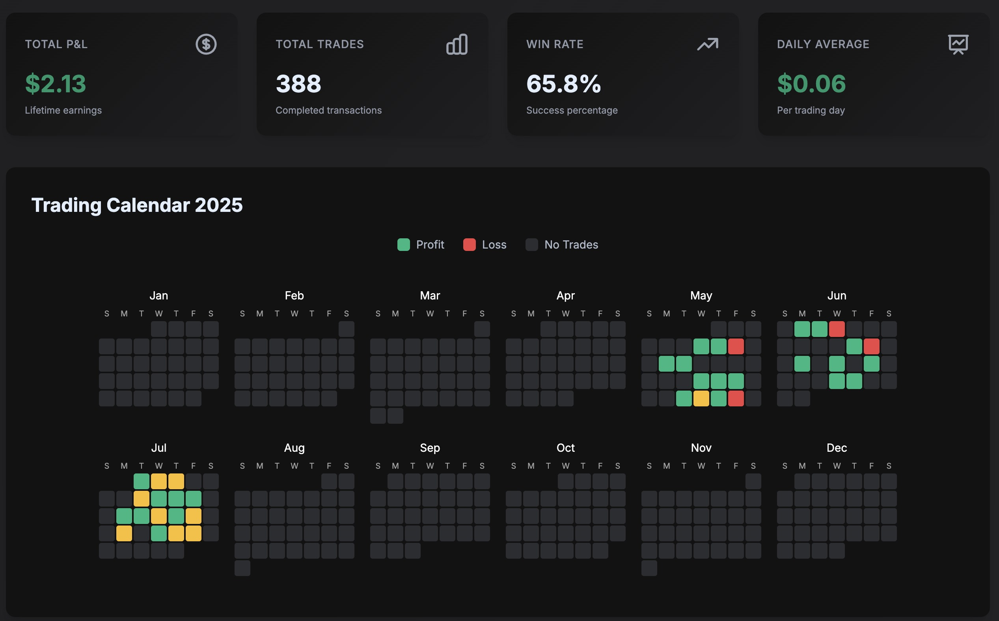

# 📊 PropReports Auto-Exporter Example

This repository demonstrates the [PropReports Auto-Exporter](https://github.com/jefrnc/propreports-auto-exporter) GitHub Action in action!



## 🎯 What This Shows

This is a live example of:
- ✅ Automated daily trading data exports
- ✅ Weekly performance summaries
- ✅ Monthly analytics reports
- ✅ Live statistics in README
- ✅ Interactive trading calendar
- ✅ GitHub Pages dashboard

<!-- STATS_START -->
### 📊 Live Trading Statistics

| Period | Trades | P&L | Win Rate |
|--------|--------|-----|----------|
| **Week 38 (partial)** | 34 | **+$303.89** | 79.4% |
| Week 37 | 176 | **+$147.00** | 76.7% |
| **September (partial)** | 294 | **-$6.59** | 76.5% |
| August | 383 | **+$56.19** | 67.4% |

#### 📈 Yearly Projection

| Metric | Actual YTD | Projected EOY |
|--------|------------|---------------|
| **Trades** | 1,114 | 1,563 |
| **P&L** | **+$131.27** | **+$184.28** |

*Based on current performance with 105 days remaining*

*Last updated: 2025-09-17 03:15 UTC*
<!-- STATS_END -->

<!-- CALENDAR_START -->
## 📅 2025 Trading Calendar


### Legend
🟩 Profit Day | 🟨 Break Even | 🟥 Loss Day | ⬜ No Trades

### 📊 2025 Statistics

| Metric | Value |
|--------|-------|
| **Total Trading Days** | 73 |
| **Total Trades** | 1,114 |
| **Total P&L** | $66.90 |
| **Win Rate** | 67.1% |
| **Profit Days** | 49 (67.1%) |
| **Loss Days** | 24 (32.9%) |
| **Best Day** | $303.89 (2025-09-15) |
| **Worst Day** | $-509.69 (2025-09-05) |
| **Daily Average** | $0.92 |

### 📈 Monthly Breakdown

| Month | Trades | P&L | Win Rate |
|-------|--------|-----|----------|
| January | 0 | **$0.00** | 0.0% |
| February | 0 | **$0.00** | 0.0% |
| March | 0 | **$0.00** | 0.0% |
| April | 0 | **$0.00** | 0.0% |
| May | 74 | **$-115.97** | 66.2% |
| June | 117 | **$-56.20** | 59.0% |
| July | 246 | **$+253.84** | 71.1% |
| August | 383 | **$+56.19** | 67.4% |

<!-- CALENDAR_END -->

## 🚀 Features Demonstrated

### 1. Automated Exports
Every day at 10 PM EST, this workflow automatically:
- Logs into PropReports
- Downloads trading data
- Saves it in JSON format
- Commits to Git for version control

### 2. Data Structure
```
exports/
├── daily/          # Daily trade data
│   └── 2025-07-26.json
├── weekly/         # Weekly summaries
│   └── 2025-W30.json
└── monthly/        # Monthly reports
    └── 2025-07.json
```

### 3. Statistics & Visualizations
- **Live Stats**: Updated automatically in this README
- **Trading Calendar**: GitHub-style contribution graph
- **Interactive Dashboard**: Available on GitHub Pages

## 🔧 Setup Your Own

1. **Use this template** or copy the workflow file
2. **Add secrets** to your repository:
   - `PROPREPORTS_DOMAIN`
   - `PROPREPORTS_USER`
   - `PROPREPORTS_PASS`
3. **Enable GitHub Pages** (optional) for the dashboard
4. **That's it!** Data will start flowing automatically

## 📈 View the Dashboard

Check out the [interactive dashboard](https://jefrnc.github.io/propreports-trading-dashboard/) for:
- Daily P&L charts
- Cumulative performance
- Monthly breakdowns
- Interactive calendar

## 🔒 Security

- All credentials are stored as GitHub Secrets
- Account numbers are automatically obfuscated
- Data stays in your private repository

## 📝 Workflow Configuration

```yaml
name: Export Trading Data

on:
  schedule:
    - cron: '0 3 * * *'  # Daily at 10 PM EST
  workflow_dispatch:     # Manual trigger

jobs:
  export:
    runs-on: ubuntu-latest
    permissions:
      contents: write
    
    steps:
    - uses: actions/checkout@v3
    
    - uses: jefrnc/propreports-auto-exporter@v1
      with:
        propreports-domain: ${{ secrets.PROPREPORTS_DOMAIN }}
        propreports-user: ${{ secrets.PROPREPORTS_USER }}
        propreports-pass: ${{ secrets.PROPREPORTS_PASS }}
        reprocess-days: '3'
        full-reprocess: 'false'
```

## 🎨 Customization Options

The action supports many parameters:
- `export-path`: Custom directory for exports
- `reprocess-days`: Handle delayed trades
- `obfuscate-account`: Privacy mode
- `generate-weekly`: Force weekly summaries
- `generate-monthly`: Force monthly reports
- `full-reprocess`: Complete historical analysis

## 📊 Example Data

<details>
<summary>Daily Export Sample</summary>

```json
{
  "exportDate": "2025-07-26 22:00:00",
  "account": "ZI*******64",
  "date": "2025-07-26",
  "trades": [
    {
      "symbol": "AAPL",
      "side": "BUY",
      "quantity": 100,
      "price": 150.25,
      "pnl": 125.50
    }
  ],
  "summary": {
    "totalTrades": 15,
    "totalPnL": 450.75,
    "winRate": 0.73
  }
}
```
</details>

## 🤝 Contributing

Found a bug or have a suggestion? Please open an issue in the [main repository](https://github.com/jefrnc/propreports-auto-exporter).

## 📄 License

This example is MIT licensed. The PropReports Auto-Exporter action is also MIT licensed.

---

⭐ If this helps you, please star the [main repository](https://github.com/jefrnc/propreports-auto-exporter)!

Built with ❤️ using [PropReports Auto-Exporter](https://github.com/jefrnc/propreports-auto-exporter)