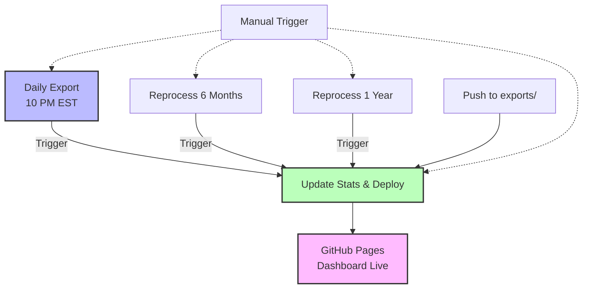

# 🔄 Workflow Guide - PropReports Trading Dashboard

## 📋 Overview

Este repositorio tiene 5 workflows organizados que automatizan la recolección, análisis y visualización de datos de trading.

## 🎯 Workflows y sus Propósitos

### 1. **01 - Daily Export** (`01-daily-export.yml`)
**Propósito**: Exporta datos diarios de trading
- **Cuándo corre**: Todos los días a las 10 PM EST
- **Qué hace**:
  1. Exporta trades del día
  2. Reprocesa últimos 3 días (por trades reportados tarde)
  3. Dispara actualización de stats y deploy
- **Trigger**: Automático diario + Manual

### 2. **02 - Reprocess Last 6 Months** (`02-reprocess-6-months.yml`)
**Propósito**: Reprocesa 6 meses de datos históricos
- **Cuándo usarlo**:
  - Necesitas corregir datos
  - Empezaste a usar la action recientemente
  - Recuperar datos perdidos
- **Qué hace**:
  1. Exporta 180 días de datos
  2. Dispara actualización de stats y deploy
- **Trigger**: Solo manual

### 3. **03 - Reprocess Last Year** (`03-reprocess-1-year.yml`)
**Propósito**: Reprocesa 1 año completo de datos
- **Cuándo usarlo**:
  - Análisis anual
  - Recuperación mayor de datos
  - Auditorías completas
- **Qué hace**:
  1. Exporta 365 días de datos
  2. Dispara actualización de stats y deploy
- **Trigger**: Solo manual

### 4. **04 - Update Stats and Deploy** (`04-update-stats-and-deploy.yml`)
**Propósito**: Actualiza estadísticas y publica en GitHub Pages
- **Cuándo corre**:
  - Después de CUALQUIER export workflow
  - En push a main (carpeta exports/)
  - Manual
- **Qué hace**:
  1. Actualiza estadísticas del README
  2. Genera calendario SVG
  3. Crea dashboard-data.json
  4. Despliega a GitHub Pages
- **Trigger**: Automático + Manual

### 5. **05 - Manual Deploy** (`05-manual-deploy.yml`)
**Propósito**: Deploy manual sin actualizar datos
- **Cuándo usarlo**:
  - Editaste HTML/CSS del dashboard
  - Necesitas redesplegar sin cambiar datos
  - Troubleshooting
- **Qué hace**:
  - Solo despliega docs/ a GitHub Pages
- **Trigger**: Push a docs/ + Manual

## 🔄 Flujo de Ejecución



## ⏰ Horario Diario

| Hora EST | Workflow | Acción |
|----------|----------|--------|
| 10:00 PM | 01-Daily Export | Inicia export de datos |
| 10:03 PM | 04-Update Stats | Se dispara automáticamente |
| 10:05 PM | GitHub Pages | Dashboard actualizado |

## 🚀 Comandos Útiles

```bash
# Ver todos los workflows
gh workflow list

# Ejecutar export diario manualmente
gh workflow run "01 - Daily Export"

# Reprocesar 6 meses
gh workflow run "02 - Reprocess Last 6 Months"

# Reprocesar 1 año
gh workflow run "03 - Reprocess Last Year"

# Actualizar stats manualmente
gh workflow run "04 - Update Stats and Deploy"

# Ver estado de workflows
gh run list --limit 5
```

## 🔧 Troubleshooting

### Stats no se actualizan
1. Verifica que el export completó exitosamente
2. Ejecuta manualmente: `gh workflow run "04 - Update Stats and Deploy"`
3. Revisa los logs del workflow

### Dashboard no muestra datos nuevos
1. Verifica que dashboard-data.json se actualizó
2. Limpia caché del navegador
3. Espera 5 minutos (GitHub Pages cache)

### Faltan datos históricos
```bash
# Para últimos 6 meses
gh workflow run "02 - Reprocess Last 6 Months"

# Para todo el año
gh workflow run "03 - Reprocess Last Year"
```

## 📁 Estructura de Datos

```
PropReports → Export Workflows → exports/
                                    ├── daily/
                                    ├── weekly/
                                    └── monthly/
                                         ↓
                              Update Stats Workflow
                                         ↓
                                 ├── README.md (stats)
                                 ├── calendar.svg
                                 └── dashboard-data.json
                                         ↓
                                  GitHub Pages
                                         ↓
                              https://jefrnc.github.io/
```

## 💡 Tips

1. **Deja que los workflows corran automáticamente** - El daily export está optimizado
2. **Usa reprocess con moderación** - Consume más llamadas API
3. **Si algo falla, espera 5 minutos** - A veces es tema de timing
4. **GitHub Pages tarda ~5 min** - Ten paciencia después del deploy

## 🔒 Seguridad

- Credenciales en GitHub Secrets
- Números de cuenta ofuscados automáticamente
- Datos en tu repositorio privado