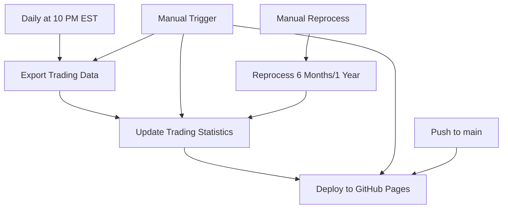

# 🔄 Workflow Guide - PropReports Trading Dashboard

## 📋 Overview

This repository has 5 GitHub Actions workflows that work together to automate trading data collection, analysis, and visualization.

## 🎯 Workflow Descriptions

### 1. **Export Trading Data** (`export.yml`)
- **Purpose**: Fetches daily trading data from PropReports
- **Trigger**: 
  - Automatically at 10 PM EST daily (`cron: '0 3 * * *'`)
  - Manual via workflow_dispatch
- **What it does**:
  - Downloads today's trades
  - Processes last 3 days (for late-reported trades)
  - Generates weekly/monthly summaries when needed
  - Commits data to `exports/` directory

### 2. **Update Trading Statistics** (`update-stats.yml`)
- **Purpose**: Updates README stats, calendar, and dashboard data
- **Trigger**:
  - Automatically after "Export Trading Data" completes
  - Daily at 11 PM EST (`cron: '0 4 * * *'`)
  - Manual via workflow_dispatch
- **What it does**:
  - Updates live statistics in README
  - Generates trading calendar SVG
  - Creates dashboard-data.json
  - Deploys to GitHub Pages

### 3. **Deploy to GitHub Pages** (`pages.yml`)
- **Purpose**: Publishes the web dashboard
- **Trigger**:
  - On push to main branch
  - Manual via workflow_dispatch
- **What it does**:
  - Deploys `docs/` folder to GitHub Pages
  - Makes dashboard available at https://jefrnc.github.io/propreports-trading-dashboard/

### 4. **Reprocess Last 6 Months** (`reprocess-6-months.yml`)
- **Purpose**: Bulk reprocess 180 days of historical data
- **Trigger**: Manual only (workflow_dispatch)
- **Use case**: When you need to fix data or recover from issues

### 5. **Reprocess Last Year** (`reprocess-1-year.yml`)
- **Purpose**: Bulk reprocess 365 days of historical data
- **Trigger**: Manual only (workflow_dispatch)
- **Use case**: Annual reviews or major data corrections

## 🔄 Workflow Execution Flow



## ⏰ Daily Schedule

1. **10:00 PM EST**: Export Trading Data runs
   - Fetches today's trades
   - Checks last 3 days for updates
   - Generates summaries

2. **10:05 PM EST** (approx): Export completes
   - Data committed to repository

3. **10:06 PM EST**: Update Trading Statistics triggered
   - Reads all export files
   - Updates README statistics
   - Generates calendar and dashboard data

4. **10:08 PM EST**: Pages deployment
   - Dashboard updated on GitHub Pages

## 🚀 Manual Operations

### Need to reprocess recent data?
```bash
# Trigger export manually
gh workflow run "Export Trading Data"
```

### Need to update statistics only?
```bash
# Update stats without new export
gh workflow run "Update Trading Statistics"
```

### Need historical data?
```bash
# Last 6 months
gh workflow run "Reprocess Last 6 Months"

# Full year
gh workflow run "Reprocess Last Year"
```

## 🔧 Troubleshooting

### Statistics not updating?
1. Check if Export Trading Data completed successfully
2. Run Update Trading Statistics manually
3. Check workflow logs for errors

### Dashboard not showing latest data?
1. Verify dashboard-data.json was updated
2. Check GitHub Pages deployment status
3. Clear browser cache (the dashboard has fallback data)

### Missing historical data?
1. Run appropriate reprocess workflow
2. Wait for Update Trading Statistics to run
3. Check exports/ directory for data files

## 📁 Data Flow

```
PropReports API
    ↓
Export Trading Data
    ↓
exports/
├── daily/YYYY-MM-DD.json      ← Daily trades
├── weekly/YYYY-WXX.json       ← Weekly summaries
└── monthly/YYYY-MM.json       ← Monthly summaries
    ↓
Update Trading Statistics
    ↓
├── README.md                  ← Live stats
├── .github/assets/calendar.svg ← Trading calendar
└── docs/dashboard-data.json   ← Dashboard data
    ↓
GitHub Pages
    ↓
https://jefrnc.github.io/propreports-trading-dashboard/
```

## 💡 Best Practices

1. **Let workflows run automatically** - The schedule is optimized for daily trading
2. **Use reprocess workflows sparingly** - They use more API calls
3. **Check logs if something fails** - Most issues are temporary
4. **Don't run multiple exports simultaneously** - Can cause data conflicts

## 🔒 Security Notes

- All credentials stored as GitHub Secrets
- Account numbers automatically obfuscated
- Data remains in your private repository
- GitHub Pages can be made private if needed