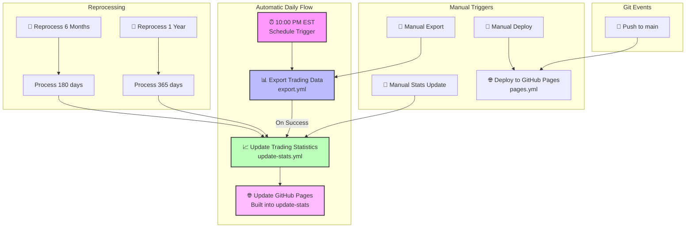

# Workflow Execution Flow

## Timing Details

| Time (EST) | Action | Duration |
|------------|--------|----------|
| 10:00 PM | Export Trading Data starts | ~2-3 min |
| 10:03 PM | Export completes, triggers stats | ~1 min |
| 10:04 PM | Stats update completes | ~30 sec |
| 10:05 PM | GitHub Pages updated | ✅ Done |

## Dependencies

- **Export Trading Data** → triggers → **Update Trading Statistics**
- **Update Trading Statistics** → includes → **GitHub Pages deployment**
- **Reprocess workflows** → trigger → **Update Trading Statistics**