# Workflow Execution Flow

```mermaid
graph TD
    subgraph "Automatic Daily Flow"
        A[⏰ 10:00 PM EST<br/>Schedule Trigger] --> B[📊 Export Trading Data<br/>export.yml]
        B -->|On Success| C[📈 Update Trading Statistics<br/>update-stats.yml]
        C --> D[🌐 Update GitHub Pages<br/>Built into update-stats]
    end
    
    subgraph "Manual Triggers"
        E[👤 Manual Export] --> B
        F[👤 Manual Stats Update] --> C
        G[👤 Manual Deploy] --> H[🌐 Deploy to GitHub Pages<br/>pages.yml]
    end
    
    subgraph "Reprocessing"
        I[📅 Reprocess 6 Months] --> J[Process 180 days]
        K[📅 Reprocess 1 Year] --> L[Process 365 days]
        J --> C
        L --> C
    end
    
    subgraph "Git Events"
        M[🔄 Push to main] --> H
    end
    
    style A fill:#f9f,stroke:#333,stroke-width:2px
    style B fill:#bbf,stroke:#333,stroke-width:2px
    style C fill:#bfb,stroke:#333,stroke-width:2px
    style D fill:#fbf,stroke:#333,stroke-width:2px
```

## Timing Details

| Time (EST) | Action | Duration |
|------------|--------|----------|
| 10:00 PM | Export Trading Data starts | ~2-3 min |
| 10:03 PM | Export completes, triggers stats | ~1 min |
| 10:04 PM | Stats update completes | ~30 sec |
| 10:05 PM | GitHub Pages updated | ✅ Done |

## Dependencies

- **Export Trading Data** → triggers → **Update Trading Statistics**
- **Update Trading Statistics** → includes → **GitHub Pages deployment**
- **Reprocess workflows** → trigger → **Update Trading Statistics**